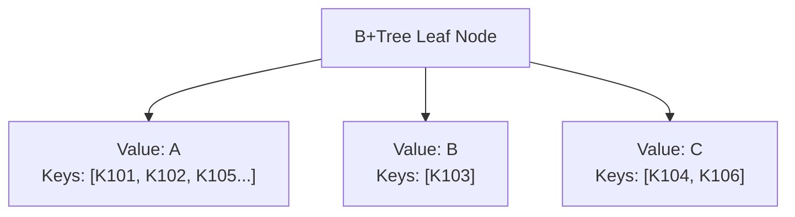
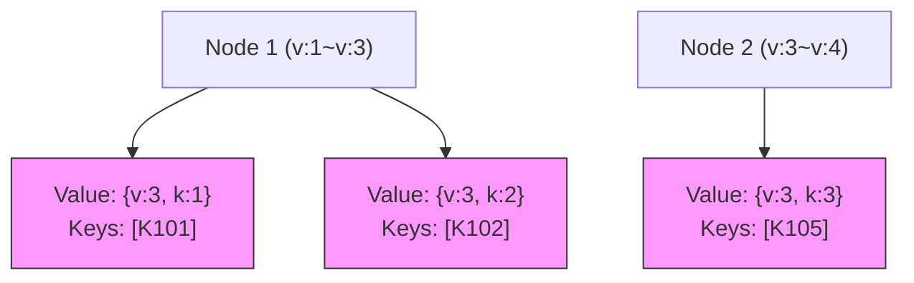

# B+Tree Duplicate Value Handling and Node Management Guide

`serializable-bptree` supports mapping multiple keys to the same value. This guide provides technical instructions for maintaining system stability and performance when large amounts of duplicate data occur.

---

## 1. Understanding Internal Mechanics

Instead of creating new nodes when handling duplicate values, this library **stores keys in an array within a single entry**.

### 📊 Data Structure Visualization


- **Insertion Logic**: When inserting new data, if the value already exists, the new key is added to the `keys` array at that index.
- **Key Characteristic**: While efficient for a small number of duplicates, this approach can cause the **array size to grow indefinitely** if data concentrates on a specific value.

---

## 2. Node Bloat Issues

When tens of thousands of data points cluster around a single value, it leads to severe performance costs.

> [!WARNING]
> **Node bloat causes bottlenecks across the entire system.**

| Category | Description | Impact |
| :--- | :--- | :--- |
| **Serialization Performance** | The massive array must be processed when converting the entire node to JSON | Sharp increase in CPU usage and latency |
| **I/O Overhead** | Adding a single key requires re-writing the entire multi-MB node | Depletion of disk write performance (IOPS) |
| **Structural Limits** | B+Tree's automatic splitting only works at the node level, not inside arrays | Leads to imbalances where specific nodes become bloated |

---

## 3. Recommended Solution: Composite Value Strategy

The most effective solution is to **assign uniqueness to the Value**, distributing data across multiple entries. This activates the B+Tree's native splitting mechanism.

### ✅ Implementation Example: Composite Comparator

Combine the sorting value (`v`) with a key (`k`) that ensures data uniqueness.

```typescript
// 1. Define Composite Value Interface
interface MyValue {
  k: number  // Key for uniqueness (e.g., ID, timestamp)
  v: number  // Actual data used for querying/sorting
}

// 2. Implement Composite Comparator
class MyValueComparator extends ValueComparator<MyValue> {
  // Actual sorting logic
  asc(a: MyValue, b: MyValue): number {
    const diff = (+a.v) - (+b.v)
    // If the primary sort (v) is the same, use the unique key (k) to distribute data.
    return diff === 0 ? (a.k - b.k) : diff
  }

  // Define primary comparison group (used for primaryEqual queries)
  primaryAsc(a: MyValue, b: MyValue): number {
    return (+a.v) - (+b.v)
  }

  match(v: MyValue): string {
    return v.v.toString()
  }
}
```

### 📈 After Adopting Composite Values

> [!TIP]
> Even if values are the same (`v:3`), they are treated as distinct entries due to the unique key (`k`), allowing normal **page splits** to occur when a node becomes full.

---

## 4. Efficient Query Methods

Since composite values distribute entries, queries must account for this structure.

### Method 1: Use `primaryEqual` (Highly Recommended)
If `primaryAsc` is defined, you can find all related data using only part of the composite value.

```typescript
// Query all data where v is 3 as quickly as possible
const results = await tree.keys({
  primaryEqual: { v: 3 } as Partial<MyValue>
})
```

### Method 2: Use Range Queries
Explicitly specify a range to collect data.

| Condition | Start Value (gte) | End Value (lte) | Remarks |
| :--- | :--- | :--- | :--- |
| **All for a specific value** | `{ v: 3, k: -Infinity }` | `{ v: 3, k: Infinity }` | Useful for total surveys of duplicate data |
| **After a specific point**| `{ v: 3, k: 100 }` | `{ v: 3, k: Infinity }` | Advantageous for pagination |

---

## 5. Additional Optimization Tips

- **Lightweight Keys**: Use integers or short hash values instead of strings to reduce the size of the key array.
- **Data Normalization**: For data with extremely high duplication (e.g., gender 'M/F'), consider linking to separate external storage using a Group ID rather than inserting directly into the B+Tree.
