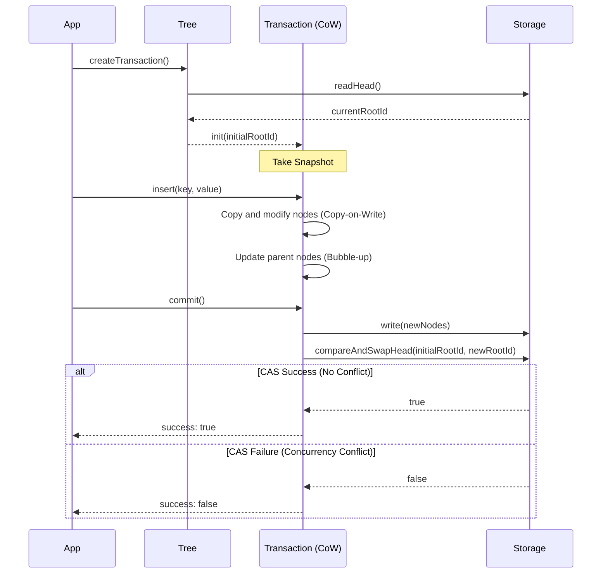

# Transaction System

`serializable-bptree` provides a robust transaction system based on **MVCC (Multi-Version Concurrency Control)** and **Optimistic Locking** to ensure high concurrency and data integrity.

## Core Concepts

1. **Snapshot Isolation**: Transactions only see a **snapshot as of the starting point**. Even if other transactions commit data in the middle, they do not affect the current transaction (prevents Phantom Reads).
2. **Copy-on-Write (CoW)**: When modifying data, it does not touch the original but **creates a new copy**. Changes are not visible to the outside until they are committed.
3. **Optimistic Locking**: No locks are held during the operation. **Conflicts are checked only at the time of commit**, which results in excellent read performance.

## Working Principle



## Failure Conditions

The main cases where a transaction fails (`success: false`) or an error occurs are as follows:

1. **Concurrency Conflict (CAS Failure)**: The most common failure cause. If another operation commits and changes the root node (`rootId`) during the transaction, `commit()` will return `false`.
2. **Storage Error**: If an I/O error or network error occurs during `strategy.write()` or `strategy.read()`, an exception will be thrown.
3. **Data Integrity Error**: Failures may occur in case of logical errors, such as failing to find a required node due to a corrupted internal structure of the tree.

## Usage

A pattern for manually controlling transactions to process multiple operations atomically.

### Basic Pattern

```typescript
const tx = await tree.createTransaction();

// 1. Perform operations (isolated transaction space)
await tx.insert(1, 'Apple');
await tx.insert(2, 'Banana');

// 2. Attempt commit
const result = await tx.commit();

if (result.success) {
  console.log("Save successful");
} else {
  // 3. Handle conflict (another transaction committed first)
  console.warn("Save failed: Data conflict");
}
```

> **Note**: Helper methods like `tree.insert(k, v)` use transactions internally and throw an `Error` upon conflict for convenience.

## Recovery Patterns

Methods for safely handling data when a conflict occurs.

### 1. Simple Retry

Conflicts can be temporary, so waiting briefly and retrying is the simplest solution.

```typescript
for (let i = 0; i < 3; i++) {
  try {
    await tree.insert(key, value); // Helper methods throw an error
    break; // Success
  } catch (e) {
    if (i === 2) throw e; // Max retries exceeded
    await new Promise(r => setTimeout(r, 100 * (i + 1))); // Exponential backoff
  }
}
```

### 2. ID Recovery and Cleanup (Garbage Collection)

When using a DB or file system, it is recommended to **delete files (nodes) created by a failed transaction**.

```typescript
const result = await tx.commit();

if (!result.success) {
  // Commit failed, but delete nodes already written to storage
  for (const id of result.createdIds) {
    await strategy.delete(id); // Save storage space
  }
}
```

## Sync vs Async

- **BPTreeAsync** (returns `Promise`): Use when **concurrency** is important, such as in web servers or DB integrations.
- **BPTreeSync** (returns value directly): Suitable for simple local file processing or single-threaded tasks.
